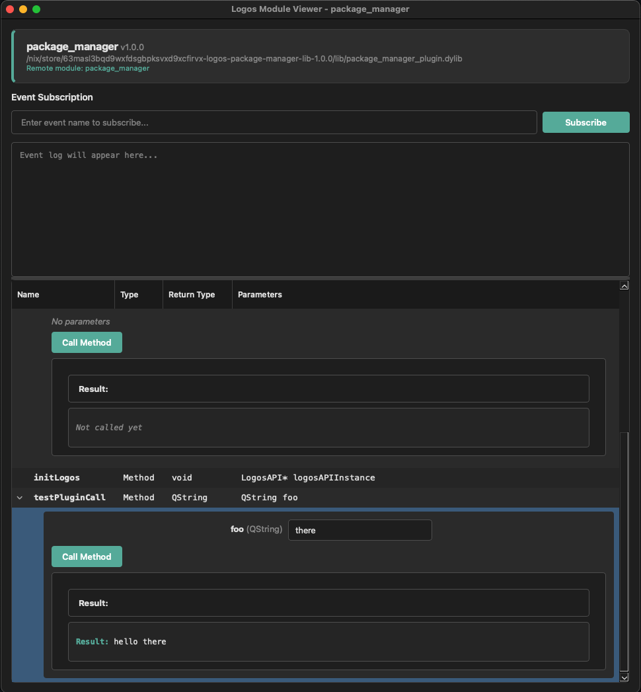

# logos-module-viewer

A Qt desktop application for inspecting Logos modules. Point it at a module
plugin and it lists the module's methods, lets you call them, and lets you
subscribe to its events — a graphical sibling of the `lm` inspector and the
`logoscore` runtime CLI.

It works with both legacy `Q_INVOKABLE` plugins and modern *universal*/cdylib
modules (whose methods are exposed through a provider object rather than the Qt
meta-object), because introspection goes through `ModuleLib::LogosModule`.



## Usage

### GUI

```bash
logos-module-viewer --module ./path/to/accounts_module_plugin.so
```

Loads the module, lists its methods as expandable call forms, and shows an event
subscription panel. Method calls and event subscriptions are dispatched over the
Logos IPC bridge to the module running in its own host process.

### Headless

The same inspection/calling, non-interactively (handy for scripts and CI):

```bash
# List the module's methods (offline — no runtime needed)
logos-module-viewer --module accounts_module_plugin.so --list-methods

# Call a method over IPC (logoscore-style "method(args)" syntax)
logos-module-viewer --module accounts_module_plugin.so \
  --modules-dir ./modules \
  --call "lengthToEntropyStrength(12)"          # => {"call":"...","result":128}

# Machine-readable output, multiple calls in sequence
logos-module-viewer --module accounts_module_plugin.so --json \
  --call "createRandomMnemonic(12)" \
  --call "lengthToEntropyStrength(24)"
```

Flags:

| Flag | Description |
|------|-------------|
| `-m`, `--module <path>` | Module plugin (`.so`/`.dylib`/`.dll`) to inspect |
| `--list-methods` | Print the module's methods and exit (headless) |
| `--call "m(a, b)"` | Call a method over IPC; repeatable (headless) |
| `--modules-dir <dir>` | Directory liblogos scans for modules + dependencies |
| `--preload <m1,m2>` | Modules to load before the target (e.g. `capability_module`) |
| `--json` | Machine-readable JSON output for headless modes |

Argument coercion follows the method signature: `12` → int, `3.14` → double,
`true`/`false` → bool, otherwise a string; `@file` loads file contents as the
argument.

## How to build

### Using Nix (recommended)

```bash
# Build the app (default). Bundles liblogos_core, logos_host, and a modules dir.
nix build '.#app'

# Run it
./result/bin/logos-module-viewer --module <plugin.so>
```

In the workspace, prefer the `ws` CLI (it wires local dependency overrides):

```bash
ws build logos-module-viewer
ws build logos-module-viewer --auto-local   # build against local workspace deps
```

> **Note:** the public GitHub `master` of `logos-liblogos` may lag the workspace
> submodule. Build through the workspace (`ws build` / `--override-input
> logos-liblogos path:./repos/logos-liblogos`) so the viewer compiles against the
> current liblogos API.

### Development shell

```bash
nix develop          # cmake/ninja + Qt + LOGOS_*_ROOT exported
cmake -S app -B build -GNinja \
  -DLOGOS_LIBLOGOS_ROOT="$LOGOS_LIBLOGOS_ROOT" \
  -DLOGOS_MODULE_ROOT="$LOGOS_MODULE_ROOT"
cmake --build build
./build/bin/logos-module-viewer --module <plugin.so>
```

## Testing

A hermetic headless self-test builds the app, loads the real
`logos-accounts-module`, and asserts both introspection and a live IPC
round-trip (`lengthToEntropyStrength(12) == 128`):

```bash
# Via the workspace (discovers the flake check):
ws test logos-module-viewer

# Or directly:
nix build '.#checks.x86_64-linux.doctest' -L
```

There is also a rendered doc-test under `doctests/` (the
[`logos-doctest`](https://github.com/logos-co/logos-doctest) format) that builds
this commit's viewer against a real module, exercises the headless modes, and
**drives the actual GUI window headlessly** — clicking through it and capturing
screenshots — via the embedded [`logos-qt-mcp`](https://github.com/logos-co/logos-qt-mcp)
inspector:

```bash
cd doctests && ./run.sh        # writes outputs/module-viewer-app.md + outputs/images/*.png
```

By default `run.sh` builds your local working tree (no commit/push needed); set
`REMOTE=1` to build the pinned GitHub commit instead.

## Dependencies

- Qt 6 (qtbase/Widgets, qtremoteobjects; qtdeclarative for the inspector)
- `logos-liblogos` — the C runtime (`liblogos_core`, `logos_host`) and the
  aggregated `LogosAPI`/`LogosAPIClient` C++ SDK
- `logos-module` — `ModuleLib::LogosModule` introspection library
- `logos-qt-mcp` — QObject inspector embedded in the GUI for headless ui_test
- `nlohmann_json` — header-only (pulled in transitively by the SDK headers)
