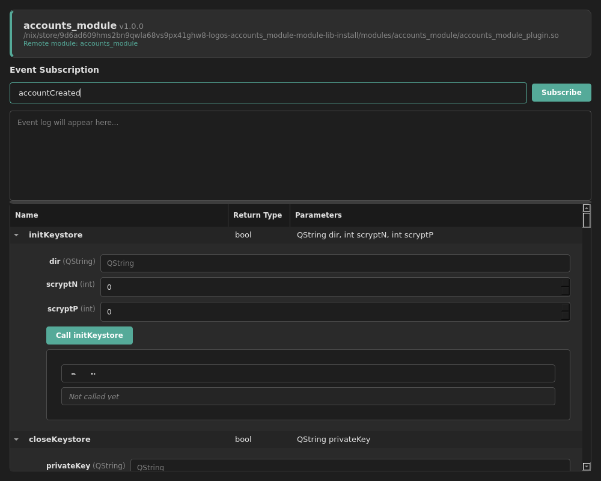

# Inspecting a Module With logos-module-viewer

`logos-module-viewer` is a desktop GUI tool for inspecting Logos modules: point
it at a module plugin and it lists the module's methods, lets you call them, and
lets you subscribe to its events — a graphical sibling of the `lm` inspector and
the `logoscore` runtime CLI.

Being a Qt **Widgets** app it has no QML inspector to drive, so it also ships a
headless mode (`--list-methods` and `--call`) that does exactly what the GUI does
but non-interactively. This doc-test exercises **this** commit of the viewer
end-to-end against a real module:

1. Build the `logos-module-viewer` app from this commit's flake (`#app`). The
   build bundles `liblogos_core`, `logos_host`, and a modules directory, and
   wires `LOGOS_HOST_PATH` so the runtime can spawn the per-module host process.
2. Build the real **[`logos-accounts-module`](https://github.com/logos-co/logos-accounts-module)**
   as an installable module tree (its flake's `#install` output).
3. Introspect `accounts_module` with `--list-methods` — proving the viewer reads
   the method surface of a modern *universal* module (whose methods live behind a
   provider object, not on the Qt meta-object).
4. Call methods over the real Logos IPC bridge with `--call`, asserting on the
   values the module returns.

Because the viewer is built from the commit under test and then loads and calls a
real module over a real `liblogos` runtime, a green run is direct evidence that
this change keeps the viewer able to inspect and exercise modules.

**What you'll build:** This `logos-module-viewer` app, run headlessly against a real `accounts_module` build.

**What you'll learn:**

- How `logos-module-viewer`'s flake exposes a ready-to-run app via its `#app` output
- How a module's flake exposes an installable module tree via its `#install` output
- How to introspect a universal module's methods with `--list-methods`
- How to call a module method over the Logos IPC bridge with `--call` and assert on the result

## Prerequisites

- **Nix** with flakes enabled. Install from [nixos.org](https://nixos.org/download.html), then enable flakes:

```bash
mkdir -p ~/.config/nix
echo 'experimental-features = nix-command flakes' >> ~/.config/nix/nix.conf
```

Verify: `nix flake --help >/dev/null 2>&1 && echo "Flakes enabled"`

- **A Linux or macOS machine.** The app runs headless via `QT_QPA_PLATFORM=offscreen`, so no display is required.

---

## How the viewer inspects a module

`logos-module-viewer` loads a module plugin in two complementary ways:

```
+------------------------+   --list-methods (offline)    +----------------------+
|   logos-module-viewer  | ----------------------------> |  ModuleLib::          |
|   (Qt Widgets app)     |   introspect method surface   |  LogosModule          |
|                        |                               +----------------------+
|                        |
|                        |   --call "m(args)"            +----------------------+
|                        | ----------------------------> |   liblogos runtime   |
|                        |   LogosAPI / invokeRemote     |   (logos_host + IPC) |
+------------------------+                               +----------+-----------+
                                                                    |
                                                        spawns      v
                                                        +----------------------+
                                                        |   accounts_module    |
                                                        |   (universal plugin) |
                                                        +----------------------+
```

Introspection goes through `ModuleLib::LogosModule`, so it works for both
legacy `Q_INVOKABLE` plugins and modern *universal* modules (whose real
methods are exposed by a provider object, not the Qt meta-object). Calls go
through `liblogos`: the viewer processes and loads the module, then dispatches
over the Logos IPC bridge to the module running in its own host process.

## Step 1: Build the module viewer

Build this commit's `logos-module-viewer` app. The result is symlinked to
`./viewer`. The `#app` output bundles `liblogos_core`, `logos_host`, and the
modules directory the runtime needs.

### 1.1 Build the app

```bash
nix build 'github:logos-co/logos-module-viewer#app' --out-link ./viewer
```

---

## Step 2: Build a module to inspect

Build the real `logos-accounts-module` as an installable module tree. Its
flake's `#install` output is a `modules/accounts_module/` directory containing
the plugin, a `manifest.json`, and a `variant` marker — exactly the layout the
viewer's `--modules-dir` scans.

### 2.1 Build accounts_module

```bash
nix build 'github:logos-co/logos-accounts-module#install' --out-link ./accounts
```

---

## Step 3: List the module's methods

Introspect `accounts_module` with `--list-methods`. This is an offline read of
the plugin's method surface — no runtime needed. A universal module like
`accounts_module` exposes its methods through a provider object, and the viewer
surfaces them all.

### 3.1 Introspect

```bash
QT_QPA_PLATFORM=offscreen logos-module-viewer \
  --module accounts_module_plugin.so --list-methods
```

The viewer prints the module's name, version, and full method list. These
are the same methods the GUI shows as expandable call forms, and the same
ones you can drive with `--call` below.

---

## Step 4: Call a method over IPC

Now call a method for real. `--call` processes and loads the module into a
`liblogos` runtime and dispatches over the Logos IPC bridge — the same path
the GUI's **Call Method** button takes. `lengthToEntropyStrength` maps a
mnemonic word count to its entropy in bits, so `12` returns exactly `128`: a
deterministic, end-to-end round-trip into **this** module.

### 4.1 Map a word count to entropy strength

```bash
QT_QPA_PLATFORM=offscreen logos-module-viewer \
  --module accounts_module_plugin.so --modules-dir ./modules \
  --call "lengthToEntropyStrength(12)"
```

### 4.2 Generate a random mnemonic

`createRandomMnemonic` returns a fresh BIP-39 phrase — a real round-trip
through the go-wallet-sdk library wrapped by the module. The phrase is
random, so we assert only that a result came back.

```bash
QT_QPA_PLATFORM=offscreen logos-module-viewer \
  --module accounts_module_plugin.so --modules-dir ./modules \
  --call "createRandomMnemonic(12)"
```

Each `--call` is a real dispatch into **this** `accounts_module` over the
Logos bridge: `lengthToEntropyStrength(12)` returns exactly `128`, and
`createRandomMnemonic(12)` returns a twelve-word phrase — the same values
the GUI would display in each method's result panel.

---

## Step 5: Drive the GUI headlessly and capture screenshots

Everything above used the headless modes. Now we drive the **actual GUI**
window — the same one a developer sees — without a display, and capture
screenshots of it inspecting and calling the module.

`logos-module-viewer` embeds the
[`logos-qt-mcp`](https://github.com/logos-co/logos-qt-mcp) QObject inspector,
so the doc-test runner can connect to the running window, assert on what it
renders, invoke its buttons, and screenshot it — all under
`QT_QPA_PLATFORM=offscreen`. The window loads `accounts_module` (passed via
the `LOGOS_MODULE_VIEWER_MODULE` / `LOGOS_MODULE_VIEWER_MODULES_DIR`
environment variables) and lists every method as its own call form.

### 5.1 Build the qt-mcp test driver

[`logos-qt-mcp`](https://github.com/logos-co/logos-qt-mcp) is the harness
that connects to the window's inspector and drives it. Build it once and
link it as `./result-mcp`.

```bash
nix build 'github:logos-co/logos-qt-mcp' -o result-mcp
```

### 5.2 Launch the window and drive it

The window opens, loads `accounts_module`, and renders its methods. We
wait for the module to appear, screenshot the loaded inspector, invoke a
method through its **Call** button (a real round-trip over the Logos
bridge, exactly as a click would do), and screenshot the result.

```bash
LOGOS_MODULE_VIEWER_MODULE="$(ls $PWD/accounts/modules/accounts_module/accounts_module_plugin.*)" \
LOGOS_MODULE_VIEWER_MODULES_DIR="$PWD/accounts/modules" \
nix run "${MODULE_VIEWER_SRC:-github:logos-co/logos-module-viewer}#app"

```




The two screenshots — embedded above and in the CI report — show the real
GUI driven headlessly: first the loaded inspector listing every
`accounts_module` method as its own call form, then the same window after
the doc-test invoked a method (a live round-trip into the module) and
typed into the event-subscription field. This is the exact window a
developer drives interactively, verified end-to-end with no display.
